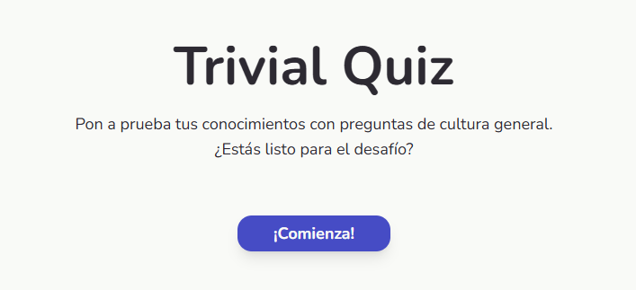
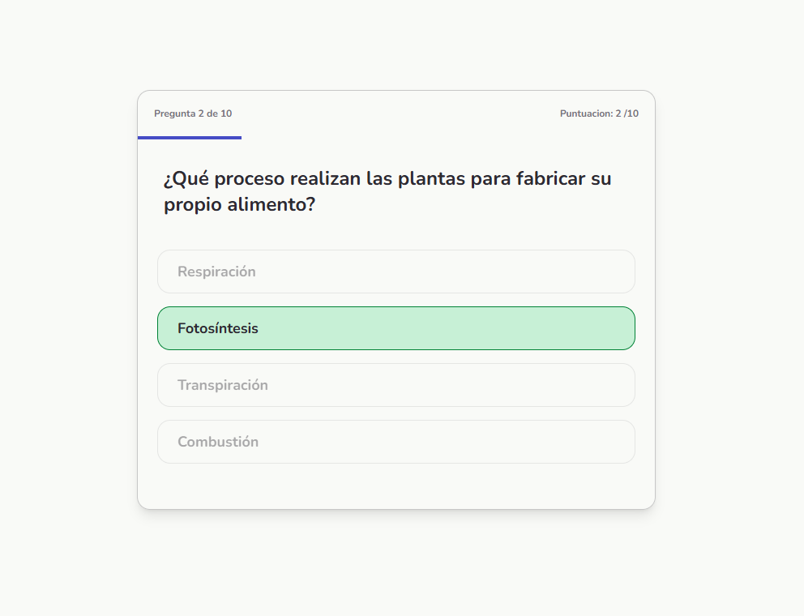

### PZ Web Developer

<a href='https://portfolio-opal-nine-21.vercel.app/'> 👉 Portfolio web 👈 </a>

# Quiz App

 

 

<h2> 🔗 <a href='https://quiz-app-omega-orpin.vercel.app/'> Live demo </a>

## 🗒️ Descripción
Aplicación web de preguntas y respuestas construida con React que integra fetching de datos desde API externa, manejo de estado reactivo, componentes reutilizables y lógica de puntuación. Ofrece múltiples categorías temáticas con interfaz responsive y feedback visual inmediato.

## 🎯 Objetivos del proyecto
- Mejorar la estructura de carpetas.
- Poner en práctica el manejo de estados con <i> Zustand</i>.
- Generar una interfaz más dinamica e interactiva.

## ✨ Características
- 🎲 Preguntas aleatorias desde API externa
- 📊 Sistema de puntuación en tiempo real
- 🎨 Interfaz responsive y moderna
- ⚡ Feedback visual inmediato

## ⚒️ Stack Tecnológico
- **React** - Librería de UI
- **TypeScript** - Tipado estático
- **Zustand** - Gestión de estado
- **Vite** - Build tool
- **Tailwind** - Estilos

## 🏗️ Escalabilidad
### Futuras implementaciones
- Filtrado de preguntas por categorías temáticas
- Sistema de selección de dificultad

 

 
👷‍♂️ Proyecto desarrollado para práctica de conceptos y aprendizaje.

 

#### 👌 ¿Te ha gustado? Puedes dejar una estrella ☺️

 

### Desarrollado con 💕 por <a href='https://portfolio-opal-nine-21.vercel.app/'>Pablo.  </a>
<a href='https://www.linkedin.com/in/pablozalliodev/'>Linkedin -</a>
<a href="mailto:pablozalliodev@gmail.com" target="_blank"> Correo </a>

